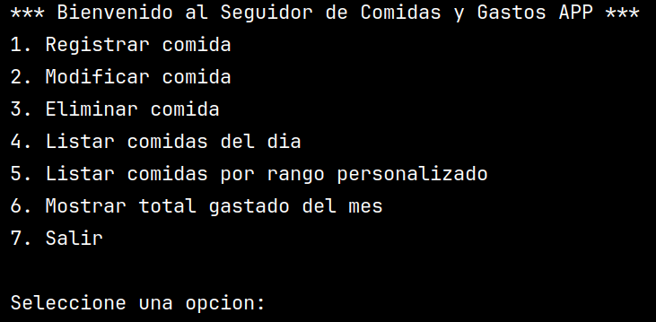

# :apple: Seguimiento de Comidas y Gastos :dollar:



Este proyecto permite llevar un registro de las comidas y los gastos realizados. Permite que el usuario se de cuenta de lo que gasta y cosume durante su dia, semana o mes.

## :computer: Tecnologias utilizadas

- JAVA
- MySQL Workbench
- JDBC
- MySQL Server

## :gear: Funcionalidades

- Registrar comidas

- Modificar comidas

- Eliminar comidas

- Listar comidas del dia

- Listar comidas por rango de fecha personalizado

- Mostrar total gastado del mes

## :hammer: Instalar la base de datos

Este proyecto utiliza una base de datos en MySQL utilizando el JDBC. Por lo tanto, es necesario que tengas instalado: **MySQL Server** y **MySQL Workbench**. Cuando instales MySQL Server generaras un usuario y un password que utilizara luego.

Luego de instalar y configurar los programas, debes abrir MySQL Workbench y crear la base datos usando el [scriptDB.sql](./SCRIPT_DB/scriptDB.sql) que esta en la carpeta :file_folder:SCRIPT_DB:file_folder: del proyecto.

En el proyecto, debes abrir y modificar la clase [Conexion.java](./src/main/java/seguimiento_comida_gastos/conexion/Conexion.java). Las variables que debes modificar son:

- ```usuario``` : colocas el nombre de usuario que creaste al instalar MySQL Server. Por lo general es root si no lo modificaste.

- ```contrasenia``` : colocas la constrasenia que generaste al instalar MySQL Server.

- ```url``` : Debes chequear en que puerto se esta alojando tu base de datos y cambiar los numertos de esta variable. Ej: ```"jdbc:mysql://localhost:3306/"```

- ```baseDatos``` : Si utilizaste el [scriptDB.sql](./SCRIPT_DB/scriptDB.sql) solo debes chequear que el valor coincida con el nombre de tu base de datos. Si creaste la base de datos con otro nombre, debes colocar ese nombre aqui.

:white_check_mark: Ya tienes tu base de datos lista para interactuar con el programa. :smile:

## :hourglass: Ejecutar la aplicacion

1. Abre el proyecto con Intellij IDEA y dirigete al [pom.xml](./pom.xml), debes darle al boton de recargar el proyecto maven (esto instalara el JDBC en el proyecto).

2. Dirigite a la carpeta :file_folder:presentacion y ejecuta la clase [SeguimientoComidasGastosAPP.java](./src/main/java/seguimiento_comida_gastos/presentacion/SeguimientoComidaGastosAPP.java)

:thumbsup: Ahora puedes probar las funcionalidades descritas anteriormente. :ok_hand:
